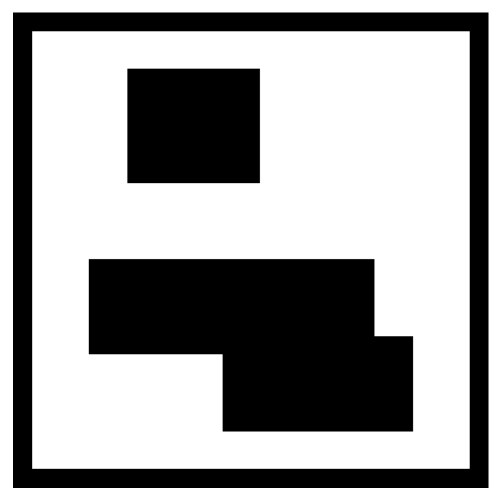
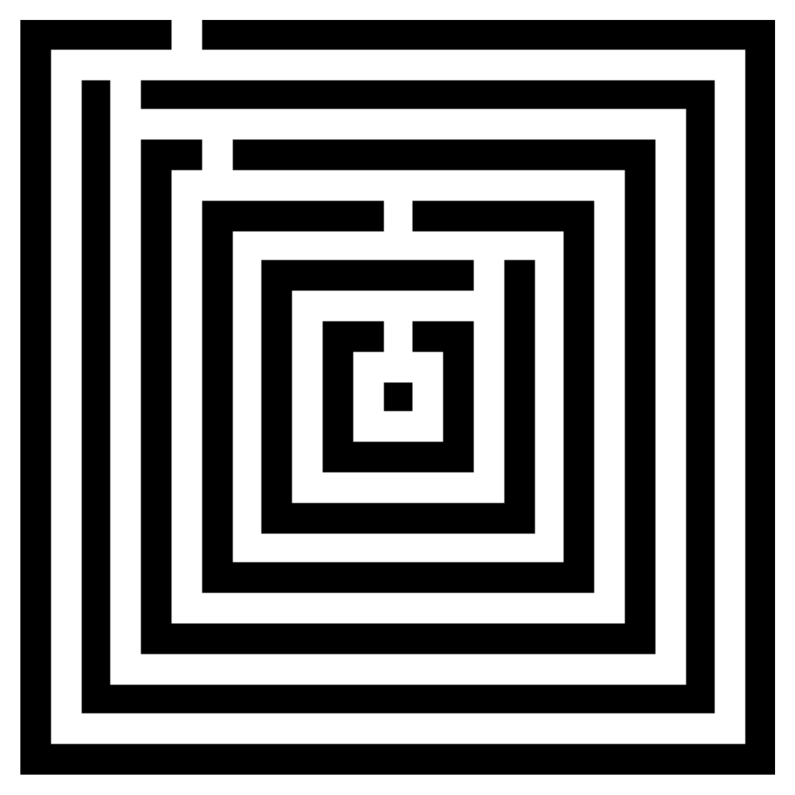
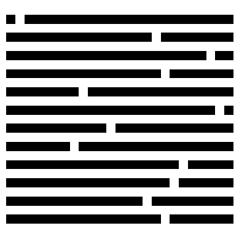

# GPT-4 Path Planning

This repository contains code for evaluating GPT-4's spatial reasoning capabilities on path planning tasks. The project focuses on single-goal path planning in grid-based environments with different geometric configurations and input representations.

## Overview

The project evaluates how GPT-4 performs on path planning tasks across different:
- **Geometries**: Rectangle blocks, maze patterns, and zig-zag configurations
- **Representations**: Natural language descriptions, grid visualizations, and code-based descriptions
- **Difficulty levels**: In-distribution (IID) and out-of-distribution (OOD) test cases

## Project Structure

### Core Scripts (`src/`)

- **`inference.py`** - Main inference script for running GPT-4 experiments
- **`evaluate.py`** - Evaluation metrics and success rate calculations
- **`planning_samples.py`** - Sample generation for different geometric configurations
- **`generate_samples.py`** - A* pathfinding and solution generation
- **`representations.py`** - Different input representation formats
- **`prompting.py`** - Few-shot prompting and example generation
- **`geometries.py`** - Geometric pattern generation (rectangles, mazes, zig-zag)
- **`helpers.py`** - Utility functions for data processing and evaluation
- **`place_agent_goals_sg.py`** - Agent and goal placement for single-goal tasks
- **`one_entrance.py`** - Zig-zag pattern generation

### Prompt Examples (`prompts/prompts-examples/`)

Contains example prompts for different geometric configurations:
- **`blocks/`** - Rectangle obstacle patterns
- **`square_maze/`** - Maze-like patterns  
- **`zig_zag/`** - Zig-zag obstacle patterns

Each geometry has three representation types:
- `*_Naive.txt` - Natural language descriptions
- `*_Grid.txt` - Grid visualizations (0=empty, 1=obstacle, 2=start, 3=goal)
- `*_Code.txt` - Code-based descriptions

## Data Format

### Geometries

This work supports 3 types of environments:

#### 1. Rectangle Blocks
Rectangular obstacle regions that create block-like barriers in the grid.



#### 2. Maze Patterns  
Spiral maze-like configurations that create complex navigation challenges.



#### 3. Zig-Zag Patterns
Alternating row or column obstacles that create zig-zag barrier patterns.




### Input Representations

1. **Naive (Natural Language)**
   ```
   You are in a 25 by 25 world. There are obstacles that you have to avoid at: (2,1), (2,2), (2,3)... Go from (23,2) to (6,5)
   ```

2. **Grid Visualization**
   ```
   0000000000000000000000000
   0000000000000000000000000
   0111111000000000000000000
   0111111000000000000000000
   ...
   ```
   Where: 0=empty, 1=obstacle, 2=start, 3=goal

3. **Code Description**
   ```python
   #The goal is to navigate a 25x25 grid to go from the initial location to the goal while avoiding obstacles
   
   obstacles = []
   goals = [(3, 13)]
   initial_location = (3, 15)
   
   for i in range(2, 5):
       for j in range(1, 6):
           obstacles.append((i, j))
   ```

### Output Format

Expected output is a sequence of directional movements:
```
left left left down up right
```

## Usage

### Running Experiments

The main inference script supports different experiment types:

```bash
python src/inference.py <experiment_type> <geometry> <representation> [additional_args]
```

**Experiment Types:**
- `env_from_file` - Test on environments from JSON files
- `decompose` - Decompose complex paths into smaller segments

**Geometries:**
- `rectangle` - Rectangular obstacle blocks
- `maze` - Maze-like spiral patterns
- `zig_zag` - Zig-zag obstacle patterns

**Representations:**
- `Naive` - Natural language descriptions
- `Grid` - Grid visualizations
- `Code` - Code-based descriptions
- `AE` - Action-effect representations

**Example:**
```bash
python src/inference.py env_from_file rectangle Grid iid_data.json ood_data.json
```

### Evaluation

Evaluate model outputs using the evaluation script:

```bash
python src/evaluate.py distance model_outputs_iid.json model_outputs_ood.json
```

**Evaluation Metrics:**
- **Success Rate**: Whether the agent reaches the goal
- **Optimality**: Whether the path length matches the optimal solution
- **Distance to Goal**: Manhattan distance from final position to goal

## Data Generation

### Generating Samples

Generate training and test data for different geometries:

```bash
python src/planning_samples.py
```

This creates JSON files with:
- `*_iid.json` - In-distribution samples (shorter paths)
- `*_ood.json` - Out-of-distribution samples (longer paths)

### Path Length Distributions

- **IID (In-Distribution)**: Path lengths 2-25 steps
- **OOD (Out-of-Distribution)**: Path lengths 25-200 steps

## Key Features

### Geometric Patterns

1. **Rectangle Blocks**: Rectangular obstacle regions
2. **Maze Patterns**: Spiral maze-like configurations
3. **Zig-Zag Patterns**: Alternating row/column obstacles

### Evaluation Approaches

1. **Few-Shot Learning**: 5-shot examples from same environment
2. **Decomposition**: Breaking complex paths into smaller segments
3. **Cross-Environment**: Testing generalization across different obstacle patterns

### Success Criteria

- **Exact Match**: Output exactly matches ground truth
- **Success**: Agent reaches the goal (regardless of path length)
- **Optimal**: Agent reaches goal with optimal path length

## Dependencies

- OpenAI API (Azure OpenAI)
- NumPy
- JSON
- Standard Python libraries

## Configuration

Update the Azure OpenAI configuration in `src/inference.py`:

```python
client = AzureOpenAI(
    azure_endpoint="your_endpoint",
    api_version="your_version", 
    api_key="your_key"
)
```

## Output Files

Results are saved to `outputs/` directory with naming convention:
```
{experiment_type}_out_5_shot_{geometry}_{representation}_{iid/ood}_fewShot_{grid_size}x{gridsize}.json
```

Each output contains:
- Grid representation
- Model prediction
- Ground truth solution
- World state
