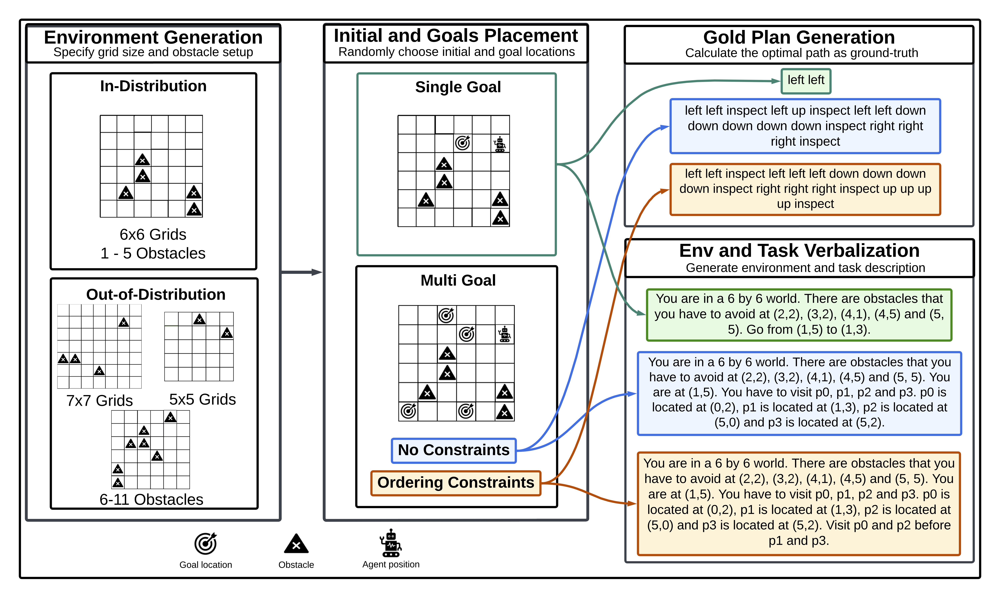

# **Path Planning from Natural Language (PPNL) Benchmark**

PPNL is a benchmark designed to assess the spatial-temporal reasoning abilities of **Large Language Models (LLMs)** through **path planning tasks**. It evaluates an LLM’s capability to navigate grid-based environments while avoiding obstacles and adhering to constraints.

## **Benchmark Overview**

### **Task Formulation**
- Given an **N × N grid** with **obstacles (O)** and a constraint **(C)**, the LLM agent must navigate from an initial location **P₀** to a set of **goal locations (P)**.
- The agent performs a sequence of actions **A = (A₁, …, Aₜ)** to complete the task successfully.

### **Task Settings**
#### **1. Single-Goal Path Planning**
- The agent must reach a **single** goal location (**l = 1**).
- **Action space**: **Up, Down, Left, Right**.

#### **2. Multi-Goal Path Planning**
- The agent must visit **multiple** goal locations (**l > 1**).
- **Two variants**:
  - **No Constraints**: Visit all goals in any order.
  - **Constrained Ordering**: Visit specific goals before others.
- **Additional action**: **Inspect** (marks a location as visited).

## **Generating New Data**

In order to generate all single goal data (using the same values as the paper), you can run the script 

``./data-synthesis/generate_all_sg_data.sh``

In order to generate all single goal data (using the same values as the paper), first run the script for the single-goal data then run the following script 

``./data-synthesis/generate_all_mg_data.sh``

In order to generate custom data, the following three steps have to be followed:

1. **Generate Environments**: run the following python script

``python data-synthesis/generate_envs $dim $num_obstacles $number_environments``

replace the command line arguments with desired values for

- **$dim - grid dimension:** This is an integer value deciding the value for *N*. For example, replace this parameter with **6** to generate **6x6** grids.
- **$num_obstacles:** The number of obstacles in the environments.
- **$num_environments:** The number of the environments to be generated.

This generated environments will be generated under 

2. **Place agent and goals**: run the following python script

``python data-synthesis/place_agent_goals.py $setting $num_goals $generate_train_set``

replace the command line arguments with desired values for

- **$setting:** A path to the directory to the environments generated in step 1.
- **$num_goals:** The number of desired goals.
- **$generate_train_set:** set to 1 if you would like to generate all sets (training, dev, seen, unseen) or 0 if you would only like the test set. 

3. **Generate the paths**: run the following python script

``python data-synthesis/generate_samples.py $dataset``

replace the command line arguments with desired values for

- **$dataset:** path to the dataset(s) generated in step 2.

## **Using Pre-generated Data**

While we recommend generating new data instances in order to avoid data contamination issues (e.g. the LLM having encountered the data during pre-training), we also provide a set of pre-generated datasets to help you get started. This can be found under the directory [single_goal](./single_goal) for the single goal setting and [multi_goal](./multi_goal) for the multi-goal setting.