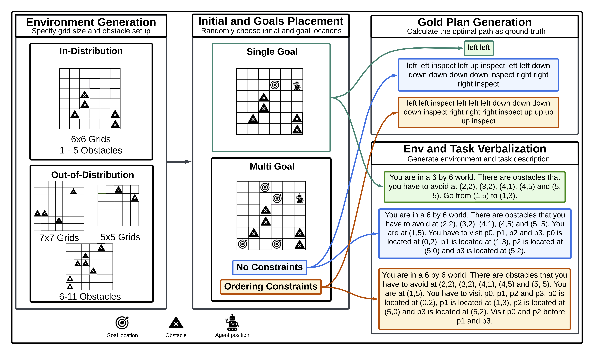

# **Path Planning from Natural Language (PPNL) Benchmark**

PPNL is a benchmark designed to assess the spatial-temporal reasoning abilities of **Large Language Models (LLMs)** through **path planning tasks**. It evaluates an LLM’s capability to navigate grid-based environments while avoiding obstacles and adhering to constraints.

## **Benchmark Overview**

### **Task Formulation**
- Given an **N × N grid** with **obstacles (O)** and a constraint **(C)**, the LLM agent must navigate from an initial location **P₀** to a set of **goal locations (P)**.
- The agent performs a sequence of actions **A = (A₁, …, Aₜ)** to complete the task successfully.

### **Task Settings**
#### **1. Single-Goal Path Planning**
- The agent must reach a **single** goal location (**l = 1**).
- **Action space**: **Up, Down, Left, Right**.

#### **2. Multi-Goal Path Planning**
- The agent must visit **multiple** goal locations (**l > 1**).
- **Two variants**:
  - **No Constraints**: Visit all goals in any order.
  - **Constrained Ordering**: Visit specific goals before others.
- **Additional action**: **Inspect** (marks a location as visited).



## **Generating New Data**

In order to generate all single goal data (using the same values as the paper), you can run the script 

``./data-synthesis/generate_all_sg_data.sh``

In order to generate all single goal data (using the same values as the paper), first run the script for the single-goal data then run the following script 

``./data-synthesis/generate_all_mg_data.sh``

Running the scripts will generate files in the following locations:

### Generated Files Location

#### Raw Environment Files
- **`data-synthesis/environments/`** - Contains base environment configurations with obstacles
  - `5x5/` - 5x5 grid environments
  - `6x6/` - 6x6 grid environments 
  - `6x6more_obstacles/` - 6x6 grids with 6-12 obstacles
  - `7x7/` - 7x7 grid environments

#### Processed Environment Files (Goal and Initial Location Placed)
- **`data-synthesis/environments_init_goal_sg/`** - Single-goal environments with agent start positions and goals
- **`data-synthesis/environments_init_goal_mg/`** - Multi-goal environments with agent start positions and multiple goals

#### Final Sample Files
- **`single_goal/`** - Processed single-goal samples with natural language descriptions and solutions
- **`multi_goal/`** - Processed multi-goal samples with natural language descriptions and solutions

### Data Statistics

#### Single Goal Environments
| File | Environments | Description |
|------|-------------|-------------|
| `1_train_set_6x6.json` | 16,032 | Training set for 6x6 grids |
| `1dev_set_6x6.json` | 2,004 | Development set for 6x6 grids |
| `1_goals_test_seen_6x6.json` | 2,004 | Test set (seen environments) for 6x6 grids |
| `1goals_unseen_6x6.json` | 5,040 | Test set (unseen environments) for 6x6 grids |
| `1_goals_test_unseen_5x5.json` | 3,750 | Test set (unseen environments) for 5x5 grids |
| `1_goals_test_unseen_7x7.json` | 3,750 | Test set (unseen environments) for 7x7 grids |
| `1_goals_test_unseen_6x6more_obstacles.json` | 4,500 | Test set (unseen environments) for 6x6 grids with more obstacles |


### Data Format and Keys

#### Raw Environment Format (`data-synthesis/environments/`)
```json
{
  "shape": [6, 6],
  "obstacles": [[5, 3], [1, 0]]
}
```

**Keys:**
- `shape`: Grid dimensions as [height, width]
- `obstacles`: List of obstacle coordinates as [row, col]

#### Processed Environment Format (`data-synthesis/environments_init_goal_sg/` and `data-synthesis/environments_init_goal_mg/`)
```json
{
  "world": [[0,0,0,0,0,0], [0,0,0,0,2,0], [0,3,0,0,0,0], ...],
  "obstacles": [[5,3]],
  "start": [1,4],
  "goals": [[2,1]]
}
```

**Keys:**
- `world`: 2D grid representation where:
  - `0` = empty cell
  - `1` = obstacle
  - `2` = agent start position
  - `3` = goal position
- `obstacles`: List of obstacle coordinates as [row, col]
- `start`: Agent starting position as [row, col]
- `goals`: List of goal positions as [row, col] (single goal for SG, multiple for MG)

#### Final Sample Format (`single_goal/` and `multi_goal/`)
```json
{
  "world": [[0,0,0,0,0,0], [0,0,0,0,2,0], [0,3,0,0,0,0], ...],
  "nl_description": "You are in a 6 by 6 world. There are obstacles that you have to avoid at: (5,3). Go from (1,4) to (2,1)",
  "solution_coordinates": [[1,4], [1,3], [1,2], [1,1], [2,1]],
  "agent_as_a_point": "left left left down ",
  "agent_has_direction": "turn right move forward move forward move forward turn left move forward ",
  "solution_inspect": "up up up up left left left inspect down down left down down down inspect "
}
```

**Keys:**
- `world`: Same as processed environment format
- `nl_description`: Natural language description of the task
- `solution_coordinates`: Optimal path as sequence of [row, col] coordinates
- `agent_as_a_point`: Solution as directional movements (up, down, left, right)
- `agent_has_direction`: Solution as turn/move commands for oriented agent
- `solution_inspect`: Multi-goal solution with "inspect" commands at goal locations (MG only)

## **Generating Custom Data**

In order to generate custom data, the following three steps have to be followed:

1. **Generate Environments**: run the following python script

``python data-synthesis/generate_envs $dim $num_obstacles $number_environments``

replace the command line arguments with desired values for

- **$dim - grid dimension:** This is an integer value deciding the value for *N*. For example, replace this parameter with **6** to generate **6x6** grids.
- **$num_obstacles:** The number of obstacles in the environments.
- **$num_environments:** The number of the environments to be generated.

This generated environments will be generated under ``/environments``

2. **Place agent and goals**: run the following python script

``python data-synthesis/place_agent_goals.py $setting $num_goals $generate_train_set``

replace the command line arguments with desired values for

- **$setting:** A path to the directory to the environments generated in step 1.
- **$num_goals:** The number of desired goals.
- **$generate_train_set:** set to 1 if you would like to generate all sets (training, dev, seen, unseen) or 0 if you would only like the test set. 

3. **Generate the paths**: run the following python script

``python data-synthesis/generate_samples.py $dataset``

replace the command line arguments with desired values for

- **$dataset:** path to the dataset(s) generated in step 2.

## **Using Pre-generated Data**

While we recommend generating new data instances in order to avoid data contamination issues (e.g. the LLM having encountered the data during pre-training), we also provide a set of pre-generated datasets to help you get started. This can be found under the directory [single_goal](./single_goal_original) for the single goal setting and [multi_goal](./multi_goal_original) for the multi-goal setting.

## Evaluation

The scripts for evaluation can be found under ``/evaluate``. 

In order to evaluate the outputs of your model, make sure your entries are saved in a ``.json`` that follows the format below:

```
{
    "english": natural language specification of the task.make sure this follows exactly the same template as the synthesized data. This should be the same as the 'nl_description' of the corresponding entry in your test set.
    "ground_truth": the ground truth plan generated during the data synthesis process.
    "generated": The plan produced by your model. 
} 
```

In order to get metrics for the model's outputs on the dataset run the following:

1. Navigate to the evaluation directory

``cd evaluate``


2. Run the correspoding executor

**Single Goal**:

``python executor-point-sg.py $path_to_model_outputs  $path_to_test_data ``

**Multi-Goal**:

``python executor-mg.py $path_to_model_outputs $path_to_test_data``

## In-Context Learning

The scripts for running in-context learning can be found under ``/ICL``. The prompts used are available under ``/ICL/prompts``. 
